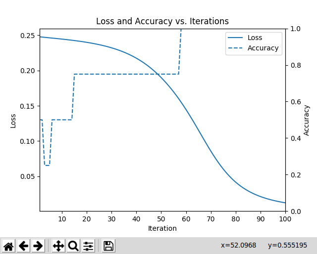

# How to Install Literally Anything: A Practical Guide to Singularity

Brian DuSell

Note: For a version of this tutorial specially tailored for the CRC computing
cluster at the University of Notre Dame, please see
[README-ND.md](README-ND.md).

## Abstract

Have you ever spent an inordinate amount of time trying to install something on
your HPC cluster without root privileges? Have you ever wrecked your computer
trying to update CUDA? Have you ever wished you could install two versions of
the same package at once? If so, containers may be what's missing in your life.
In this talk, I will show you how to install software using Singularity, an
HPC-centric container system that, like Docker, allows you to install software
in a portable, self-contained Linux environment where you have full
administrative rights. Singularity can be installed on any Linux machine (with
techniques available for running it on Windows and Mac) and is becoming
increasingly available on HPC clusters, thus ensuring that your code can run
in a consistent environment no matter which machine you run it on. Singularity
is compatible with Docker images and can make installing tricky libraries,
such as CUDA, as simple as pulling a pre-built image. My tutorial will include
a walkthrough of using Singularity to run a GPU-accelerated PyTorch program on
an HPC cluster, as well as general tips for setting up an efficient workflow.

Watch the screencast [here](https://www.youtube.com/watch?v=D5pe4ewtDe8).

Slides available [here](slides.pdf).

## Introduction

This tutorial will introduce you to [Singularity](https://www.sylabs.io/singularity/),
a containerization system for scientific computing environments that is
available on many scientific computing clusters. Containers allow you to
package the environment that your code depends on inside of a portable unit.
This is extremely useful for ensuring that your code can be run portably
on other machines. It is also useful for installing software, packages,
libraries, etc. in environments where you do not have root privileges, like an
HPC account. I will show you how to install PyTorch with GPU support inside of
a container and run a simple PyTorch program to train a neural net.

## The Portability Problem

The programs we write depend on external environments, whether that environment
is explicitly documented or not. For example, a Python program assumes that a
Python interpreter is available on the system it is run on.

```python
def f(n):
    return 2 * n
```

However, some Python code requires certain versions of Python. For example,
a Python program that uses set comprehension syntax requires Python 3.

```python
def f(n):
    return { 2 * x for x in range(n) }
```

A Python program that uses the function `subprocess.run()` assumes that you're
using at least version 3.5.

```python
import subprocess

def f():
    return subprocess.run(...)
```

This Python program additionally assumes that ImageMagick is available on the
system.

```python
import subprocess

def f():
    return subprocess.run([
        'convert', 'photo.jpg', '-resize', '50%', 'photo.png'])
```

We can go ever deeper down the rabbit hole.

When these sorts of dependencies are undocumented, it can become painful to run
a program in an environment that is different from the one it was developed in.
It would be nice to have a way to package a program together with its
environment, and then run that program on any machine.

## The Installation Problem

A scientific computing enviroment typically provides users with an account and
a home directory in a shared file system. This means that users do not have
root privileges and cannot use a package manager like `yum` or `apt-get` to
install new libraries. If you want to install something that is not already
there, you have a few options:

* If it is a major library, ask the cluster's staff to install/update it for you
* Install it in your home directory (e.g. `pip install --user` for Python
  modules) or other non-standard directory
* Compile it yourself in your home directory

While it is almost always possible to re-compile a library yourself without
root privileges, it can be very time-consuming. This is especially true when
the library depends on other libraries that also need to be re-compiled,
leading to a tedious search for just the right configuration to stitch them all
together. CUDA also complicates the situation, as certain deep learning
libraries need to be built on a node that has a GPU (even though the GPU is
never used during compilation!).

Finally, sometimes you deliberately want to install an older version of a
package. But unless you set up two isolated installations, this could conflict
with projects that still require the newer versions.

To take an extreme (but completely real!) example, older versions of the deep
learning library [DyNet](https://dynet.readthedocs.io/en/latest/) could only be
built with an old version of GCC, and moreover needed to be compiled on a GPU
node with my HPC cluster's CUDA module loaded in order to work properly. In May
2018, the staff removed the required version of GCC. This meant that if you
wanted to install or update DyNet, you needed to re-compile that version of GCC
yourself *and* figure out how to configure DyNet to build itself with a
compiler in a non-standard location.

## The Solution: Containers

Containers are a software isolation technique that has exploded in popularity
in recent years, particularly thanks to [Docker](https://www.docker.com/).
A container, like a virtual machine, is an operating system within an operating
system. Unlike a virtual machine, however, it shares the kernel with the host
operating system, so it incurs no performance penalty for translating machine
instructions. Instead, containers rely on special system calls that allow the
host to spoof the filesystem and network that the container has access to,
making it appear from inside the container that it exists in a separate
environment.

Today we will be talking about an alternative to Docker called Singularity,
which is more suitable for scientific computing environments (Docker is better
suited for things like cloud applications, and there are reasons why it would
not be ideal for a shared scientific computing environment). Singularity is
customarily available via the `singularity` command.

Singularity containers are instantiated from **images**, which are files that
define the container's environment. The container's "root" file system is
distinct from that of the host operating system, so you can install whatever
software you like as if you were the root user. Installing software via the
built-in package manager is now an option again. Not only this, but you can
also choose a pre-made image to base your container on. Singularity is
compatible with Docker images (a very deliberate design decision), so it can
take advantage of the extremely rich selection of production-grade Docker
images that are available. For example, there are pre-made images for fresh
installations of Ubuntu, Python, TensorFlow, PyTorch, and even CUDA. For
virtually all major libraries, getting a pre-made image for X is as simple as
Googling "X docker" and taking note of the name of the image.

Also, because your program's environment is self-contained, it is not affected
by changes to the HPC cluster's software and is no longer susceptible to
"software rot." Because the container is portable, it will also run just as
well on your local machine as on the HPC cluster. In the age of containers,
"it runs on my machine" is no longer an excuse.

## Basic Workflow

Singularity instantiates containers from images that define their environment.
Singularity images are stored in `.sif` files. You build a `.sif` file by
defining your environment in a text file and providing that definition to the
command `singularity build`.

Building an image file does require root privileges, so it is most convenient
to build the image on your local machine or workstation and then copy it to
your HPC cluster via `scp`. The reason it requires root is because the kernel
is shared, and user permissions are implemented in the kernel. So if you want
to do something in the container as root, you actually need to *be* root on
the host when you do it.

There is also an option to build it without root privileges. This works by
sending your definition to a remote server and building the image there, but I
have had difficulty getting this to work.

Once you've uploaded your image to your HPC cluster, you can submit a batch
job that runs `singularity exec` with the image file you created and the
command you want to run. That's it!

## A Simple PyTorch Program

I have included a PyTorch program,
[`train_xor.py`](examples/xor/train_xor.py),
that trains a neural network to compute the XOR function and then plots the
loss as a function of training time. It can also save the model to a file. It
depends on the Python modules `torch`, `numpy`, and `matplotlib`.

## Installing Singularity

Consult your HPC cluster's documentation or staff to see if it supports
Singularity. It is normally available via the `singularity` command. The
documentation for the latest version, 3.2, can be found
[here](https://www.sylabs.io/guides/3.2/user-guide/).

If Singularity is not installed, consider
[requesting
it](https://www.sylabs.io/guides/3.2/user-guide/installation.html#singularity-on-a-shared-resource).

As for installing Singularity locally, the Singularity docs include detailed
instructions for installing Singularity on major operating systems
[here](https://www.sylabs.io/guides/3.2/user-guide/installation.html).

## Defining an Image

The first step in defining an image is picking which base image to use. This
can be a Linux distribution, such as Ubuntu, or an image with a library
pre-installed, like one of PyTorch's
[official Docker images](https://hub.docker.com/r/pytorch/pytorch/tags). Since
our program depends on more than just PyTorch, let's start with a plain Ubuntu
image and build up from there.

Let's start with the basic syntax for definition files, which is documented
[here](https://www.sylabs.io/guides/3.2/user-guide/definition_files.html).
The first part of the file is the header, where we define the base image and
other meta-information. The only required keyword in the header is `Bootstrap`,
which defines the type of image being imported. Using `Bootstrap: library`
means that we are importing a library from the official
[Singularity Library](https://cloud.sylabs.io/library).
Using `Bootstrap: docker` means that we are importing a Docker image from a
Docker registry such as
[Docker Hub](https://hub.docker.com/).
Let's import the official
[Ubuntu 18.04](https://cloud.sylabs.io/library/_container/5baba99394feb900016ea433)
image.

```
Bootstrap: library
From: ubuntu:18.04
```

The rest of the definition file is split up into several **sections** which
serve special roles. The `%post` section defines a series of commands to be run
while the image is being built, inside of a container as the root user. This
is typically where you install packages. The `%environment` section defines
environment variables that are set when the image is instantiated as a
container. The `%files` section lets you copy files into the image. There are
[many other types of section](https://www.sylabs.io/guides/3.2/user-guide/definition_files.html#sections).

Let's use the `%post` section to install all of our requirements using
`apt-get` and `pip3`.

```
%post
    # These first few commands allow us to find the python3-pip package later
    # on.
    apt-get update -y
    # Using "noninteractive" mode runs apt-get while ensuring that there are
    # no user prompts that would cause the `singularity build` command to hang.
    DEBIAN_FRONTEND=noninteractive apt-get install -y --no-install-recommends \
        software-properties-common
    add-apt-repository universe
    # Downloads the latest package lists (important).
    apt-get update -y
    # python3-tk is required by matplotlib.
    DEBIAN_FRONTEND=noninteractive apt-get install -y --no-install-recommends \
        python3 \
        python3-tk \
        python3-pip \
        python3-distutils \
        python3-setuptools
    # Reduce the size of the image by deleting the package lists we downloaded,
    # which are useless now.
    rm -rf /var/lib/apt/lists/*
    # Install Python modules.
    pip3 install torch numpy matplotlib
```

Each line defines a separate command (lines can be continued with a `\`).
Unlike normal shell scripts, the build will be aborted as soon as one of the
commands fails. You do not need to connect the commands with `&&`.

The final build definition is in the file
[version-1.def](examples/xor/version-1.def).

## Building an Image

Supposing we are on our own Ubuntu machine, we can build this definition into
a `.sif` image file using the following command:

```bash
cd examples/xor
sudo singularity build version-1.sif version-1.def
```

[View the screencast](https://bdusell.github.io/singularity-tutorial/casts/version-1.html)

This ran the commands we defined in the `%post` section inside a container and
afterwards saved the state of the container in the image `version-1.sif`.

## Running an Image

Let's run our PyTorch program in a container based on the image we just built.

```bash
singularity exec version-1.sif python3 train_xor.py --output model.pt
```

This program does not take long to run. Once it finishes, it should open a
window with a plot of the model's loss and accuracy over time.

[](https://asciinema.org/a/Lqq0AsJSwVgFoo1Hr8S7euMe5)



The trained model should also be saved in the file `model.pt`. Note that even
though the program ran in a container, it was able to write a file to the host
file system that remained after the program exited and the container was shut
down. If you are familiar with Docker, you probably know that you cannot write
files to the host in this way unless you explicitly **bind mount** two
directories in the host and container file system. Bind mounting makes a file
or directory on the host system synonymous with one in the container.

For convenience, Singularity
[binds a few important directories by
default](https://www.sylabs.io/guides/3.2/user-guide/bind_paths_and_mounts.html):

* Your home directory
* The current working directory
* `/sys`
* `/proc`
* others (depending on the version of Singularity)

You can add to or override these settings if you wish using the
[`--bind` flag](https://www.sylabs.io/guides/3.2/user-guide/bind_paths_and_mounts.html#specifying-bind-paths)
to `singularity exec`. This is important to remember if you want to access a
file that is outside of your home directory -- otherwise you may end up with
inexplicable "file or directory does not exist" errors. If you encounter
cryptic errors when running Singularity, make sure that you have bound all of
the directories you intend your program to have access to.

It is also important to know that, unlike Docker, environment variables are
inherited inside the container for convenience. This can be a good and a bad
thing. It is good in that it is often convenient, but it is bad in that the
containerized program may behave differently on different hosts for apparently
no reason if the hosts export different environment variables. This behavior
can be disabled by running Singularity with `--cleanenv`.

Here is an example of when you might want to inherit environment variables.
By default, if there are multiple GPUs available on a system, PyTorch will
grab the first GPU it sees (some toolkits grab all of them). However, your
cluster may allocate a specific GPU for your batch job that is not
necessarily the one that PyTorch would pick. If PyTorch does not respect
this assignment, there can be contention among different jobs. You can
control which GPUs PyTorch has access to using the environment variable
`CUDA_VISIBLE_DEVICES`. As long as your cluster defines this environment
variable for you, you do not need to explicitly forward it to the Singularity
container.

## Running an Interactive Shell

You can also open up a shell inside the container and run commands there. You
can `exit` when you're done. Note that since your home directory is
bind-mounted, the shell inside the container may run your shell's startup file
(e.g. `.bashrc`).

```
$ singularity shell version-1.sif
Singularity version-1.sif:~/singularity-tutorial/examples/xor> python3 train_xor.py
```

Again, this an instance of the host environment leaking into the container in
a potentially unexpected way that you should be mindful of.

## Running an Image

At this point, you may wish to follow along with the tutorial on a system where
Singularity is installed, either on a personal workstation or on an HPC
account.

You can pull the first tutorial image like so:

```bash
singularity pull version-1.sif library://brian/default/singularity-tutorial:version-1
```

Next, clone this repository.

```bash
git clone https://github.com/bdusell/singularity-tutorial.git
```

Run the program like this:

```bash
cd singularity-tutorial/examples/xor
singularity exec ../../../version-1.sif python3 examples/xor/train_xor.py
```

This program is running the `python3` executable that exists inside the image
`version-1.sif`. It is *not* running the `python3` executable on the host.
Crucially, the host does not even need to have `python3` installed.

You should get the same plot from before to show up. This would not have been
possible using the software provided on my own HPC cluster, since its Python
installation does not include Tk, which is required by matplotlib. I have
found this extremely useful for making plots from data I have stored on the
cluster without needing to download the data to another machine.

## A Beefier PyTorch Program

As an example of a program that benefits from GPU acceleration, we will be
running the official
[`word_language_model`](https://github.com/pytorch/examples/tree/master/word_language_model)
example PyTorch program, which I have included at
[`examples/language-model`](examples/language-model).
This program trains an
[LSTM](https://en.wikipedia.org/wiki/Long_short-term_memory)
[language model](https://en.wikipedia.org/wiki/Language_model)
on a corpus of Wikipedia text.

## Adding GPU Support

In order to add GPU support, we need to include CUDA in our image. In
Singularity, this is delightfully simple. We just need to pick one of
[Nvidia's official Docker images](https://hub.docker.com/r/nvidia/cuda)
to base our image on. Again, the easiest way to install library X is often to
Google "X docker" and pick an image from the README or tags page on Docker Hub.

The README lists several tags. They tend to indicate variants of the image that
have different components and different versions of things installed. Let's
pick the one that is based on CUDA 10.1, uses Ubuntu 18.04, and includes cuDNN
(which PyTorch can leverage for highly optimized neural network operations).
Let's also pick the `devel` version, since PyTorch needs to compile itself in
the container. This is the image tagged `10.1-cudnn7-devel-ubuntu18.04`. Since
the image comes from the nvidia/cuda repository, the full image name is
`nvidia/cuda:10.1-cudnn7-devel-ubuntu18.04`.

Our definition file now looks
[like this](examples/language-model/version-2.def). Although we don't need it,
I kept matplotlib for good measure.

```
Bootstrap: docker
From: nvidia/cuda:10.1-cudnn7-devel-ubuntu18.04

%post
    # Downloads the latest package lists (important).
    apt-get update -y
    # Runs apt-get while ensuring that there are no user prompts that would
    # cause the build process to hang.
    # python3-tk is required by matplotlib.
    DEBIAN_FRONTEND=noninteractive apt-get install -y --no-install-recommends \
        python3 \
        python3-tk \
        python3-pip \
        python3-setuptools
    # Reduce the size of the image by deleting the package lists we downloaded,
    # which are useless now.
    rm -rf /var/lib/apt/lists/*
    # Install Python modules.
    pip3 install torch numpy matplotlib
```

We build the image as usual.

```bash
cd examples/language-model
sudo singularity build version-2.sif version-2.def
```

[View the screencast](https://bdusell.github.io/singularity-tutorial/casts/version-2.html)

We run the image like before, except that we have to add the `--nv` flag to
allow the container to access the Nvidia drivers on the host in order to use
the GPU. That's all we need to get GPU support working. Not bad!

This program takes a while to run. When I run one epoch on my workstation
(which has a GPU), the output looks like this:

```
$ singularity exec --nv version-2.sif python3 main.py --cuda --epochs 1
| epoch   1 |   200/ 2983 batches | lr 20.00 | ms/batch 45.68 | loss  7.63 | ppl  2050.44
| epoch   1 |   400/ 2983 batches | lr 20.00 | ms/batch 45.11 | loss  6.85 | ppl   945.93
| epoch   1 |   600/ 2983 batches | lr 20.00 | ms/batch 45.03 | loss  6.48 | ppl   653.61
| epoch   1 |   800/ 2983 batches | lr 20.00 | ms/batch 46.43 | loss  6.29 | ppl   541.05
| epoch   1 |  1000/ 2983 batches | lr 20.00 | ms/batch 45.50 | loss  6.14 | ppl   464.91
| epoch   1 |  1200/ 2983 batches | lr 20.00 | ms/batch 44.99 | loss  6.06 | ppl   429.36
| epoch   1 |  1400/ 2983 batches | lr 20.00 | ms/batch 45.27 | loss  5.95 | ppl   382.01
| epoch   1 |  1600/ 2983 batches | lr 20.00 | ms/batch 45.09 | loss  5.95 | ppl   382.31
| epoch   1 |  1800/ 2983 batches | lr 20.00 | ms/batch 45.25 | loss  5.80 | ppl   330.43
| epoch   1 |  2000/ 2983 batches | lr 20.00 | ms/batch 45.08 | loss  5.78 | ppl   324.42
| epoch   1 |  2200/ 2983 batches | lr 20.00 | ms/batch 45.11 | loss  5.66 | ppl   288.16
| epoch   1 |  2400/ 2983 batches | lr 20.00 | ms/batch 45.14 | loss  5.67 | ppl   291.00
| epoch   1 |  2600/ 2983 batches | lr 20.00 | ms/batch 45.21 | loss  5.66 | ppl   287.51
| epoch   1 |  2800/ 2983 batches | lr 20.00 | ms/batch 45.02 | loss  5.54 | ppl   255.68
-----------------------------------------------------------------------------------------
| end of epoch   1 | time: 140.54s | valid loss  5.54 | valid ppl   254.69
-----------------------------------------------------------------------------------------
=========================================================================================
| End of training | test loss  5.46 | test ppl   235.49
=========================================================================================
```

## Separating Python modules from the image

Now that you know the basics of how to run a GPU-accelerated program, here's a
tip for managing Python modules. There's a problem with our current workflow.
Every time we want to install a new Python library, we have to re-build the
image. We should only need to re-build the image when we install a package with
`apt-get` or inherit from a different base image -- in other words, actions
that require root privileges. It would be nice if we could store our Python
libraries in the current working directory using a **package manager**, and
rely on the image only for the basic Ubuntu/CUDA/Python environment.

[Pipenv](https://github.com/pypa/pipenv) is a package manager for Python. It's
like the Python equivalent of npm (Node.js package manager) or Bundler (Ruby
package manager). It keeps track of the libraries your project depends on in
text files named `Pipfile` and `Pipfile.lock`, which you can commit to version
control in lieu of the massive libraries themselves. Every time you run
`pipenv install <library>`, Pipenv will update the `Pipfile` and download the
library locally. The important thing is that, rather than putting the library
in a system-wide location, Pipenv installs the library in a *local* directory
called `.venv`. The benefit of this is that the libraries are stored *with*
your project, but they are not part of the image. The image is merely the
vehicle for running them.

Here is the
[new version](examples/language-model/version-3.def)
of our definition file:

```
BootStrap: docker
From: nvidia/cuda:10.1-cudnn7-devel-ubuntu18.04

%post
    # Downloads the latest package lists (important).
    apt-get update -y
    # Runs apt-get while ensuring that there are no user prompts that would
    # cause the build process to hang.
    # python3-tk is required by matplotlib.
    # python3-dev is needed to install some packages.
    DEBIAN_FRONTEND=noninteractive apt-get install -y --no-install-recommends \
        python3 \
        python3-tk \
        python3-pip \
        python3-dev
    # Reduce the size of the image by deleting the package lists we downloaded,
    # which are useless now.
    rm -rf /var/lib/apt/lists/*
    # Install Pipenv.
    pip3 install pipenv

%environment
    # Pipenv requires a certain terminal encoding.
    export LANG=C.UTF-8
    export LC_ALL=C.UTF-8
    # This configures Pipenv to store the packages in the current working
    # directory.
    export PIPENV_VENV_IN_PROJECT=1
```

Download the new image.

```bash
singularity pull version-3.sif library://brian/default/singularity-tutorial:version-3
```

Now we can use the container to install our Python libraries into the current
working directory. We do this by running `pipenv install`.

```bash
singularity exec version-3.sif pipenv install torch numpy matplotlib
```

[](https://asciinema.org/a/cywx1Ta3XpO89DvwaE0MaogDo)

This may take a while. When it is finished, it will have installed the
libraries in a directory named `.venv`. The benefit of installing packages like
this is that you can install new ones without re-building the image, and you
can re-use the image for multiple projects. The `.sif` file is smaller too.

When you're done, you can test it out using the following command:

```bash
singularity exec --nv version-3.sif pipenv run python main.py --cuda --epochs 6
```

Notice that we have replaced the command `python3` with `pipenv run python`.
This command uses the Python executable managed by Pipenv, which in turn exists
inside of the container.

## Docker

If this container stuff interests you, you might be interested in
[Docker](https://www.docker.com/)
too. Docker has its own set of idiosyncrasies, but a good place to start is the
[Docker documentation](https://docs.docker.com/).

This would be a good time to plug my
[dockerdev](https://github.com/bdusell/dockerdev)
project, which is a bash library that sets up a streamlined workflow for using
Docker containers as development environments.

## Conclusion

By now I think I have shown you that the sky is the limit when it comes to
containers. Hopefully this will prove useful to your research. If you like, you
can show your appreciation by leaving a star on GitHub. :)
